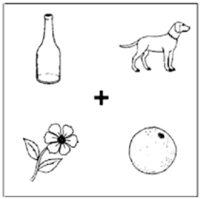
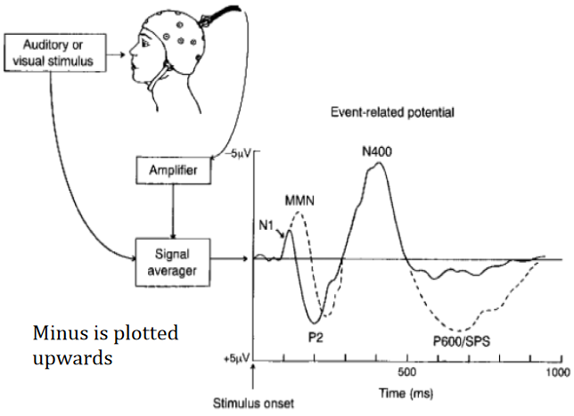
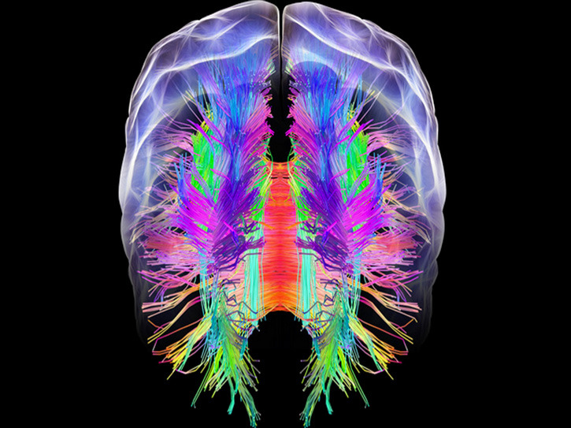

# 1. Introduction

## Basic Assumptions about Language

Basic assumptions:

- **Embodiedness**
  - "Language affected by and transmitted via *the body*"
- **Embeddedness**
  - "Language affects and is affected by *social situations*"
  - brain’s evolution is co-determined by social developments
- **Mental Models**

  - "Humans *represent* the world *internally*"
  - includes perceptual, spatial, emotional, causal and temporal info
- **Incremental Processing**

  - "Humans process language *over time* and *in parts*"
  - when analyzing messages, stores info is compared to the incoming signal (lexically, syntactically, semantically and world-knowledge-y) including emotion and motor aspects

## Language and Communication

**Communication:** *“Every action with which a person exchanges information (about needs, desires, perceptions, knowledge or affective states). Can be intentional or unintentional.”*

- No principled separation between language and other cognitive domains, since cognitive systems are modular (as can be seen in sign language).

Types of context:

- **Physical** 

  - e.g. location, time, temperature, situation of participants

- **Historical**

  - shared information (i.e. common ground)
- **Psychological**

  - perception of self and others
- **Cultural**
  - shared knowledge systems (e.g. attitude, values, behaviours)

  

**Message:** *“Consists of complex meanings, expressed via both verbal and non-verbal symbols”*

**Symbol:** *“Can be words, sounds and actions. Supported by facial expressions, gestures and intonation”*

**Encoding:** *“Turning ideas and feelings into messages”*

**Medium (of the message):** *“Any technology that created extensions of the human body and senses”*

- The “form” of the message (e.g. how spoken words are said)
- Considered as part of the message:
  - media create their own environments. Which are beneficial to some messages and hostile to others. Which influence the interpretation of the message.
  - people might be unaware of the effects of the environment their messages reside in, because they don’t know any better

Language can be seen as a medium that extends human senses, in the sense of:

- **motor behaviour** (expressions can be seen as actions)
- **perception** (getting information from far away, e.g books)
- **emotion** (e.g. hearing a sad story makes you sad)
- **memory** (using language to record a memory)

Humans communicate via their 5 sensory channels. Using multiple channels *simultaniously* increases the chance for successful communication.

**Noise:** *“Any stimulus that disrupts the sharing of meaning”*

- includes internal stimuli like being tired
- **Semantic noise**: "unintended meaning"

**Feedback**: *“Any reaction to messages that indicate that the message came across/is understood”*

## Evolution of language

- Broca’s area was likely already present 2 million years ago
- We’ve had fundamental speech apparatus structures for 60.000 years
- The shapes of our tongues, mouths and throats allows us to make many different sounds but also gives us too many teeth and an increased risk of choking
- **Two theories** of evolution of language:
  - Discontinuous**: language arose suddenly and spread quickly due to evolutionary advantages and passing the ability to offspring.
  - **Continuous**: gradual co-evolution of language and other human capabilities.
- **Theory** on why **communication** was beneficial for evolution:
  - Internal representation of the world proved to be a huge advantage in protecting the body.

**MacWhinney’s 4 periods of co-evolution: (Continuous theory)**

| Name                                          | Features                         | Period                       |
| --------------------------------------------- | :------------------------------- | ---------------------------- |
| Two Legs                                      | cognitive control planning  | 8 - 4 million years ago      |
| Social Cohesion                               | vocal-auditory neuronal changes  | 4 - 2 million years ago      |
| Mimesis                                       | gestures signs singing | 2 - 0.1 million years ago    |
| Phonological and Lexical systematization | -                                | 0.06 million years ago - now |

   

| Sender-Receiver Model                                        |                                                 |
| ------------------------------------------------------------ | ----------------------------------------------- |
| The sender encodes meaning into a message and sends it through a channel.The receiver decodes the received message into meaning.   Certain factors (such as noise) can result in differences between the encoded and decoded message.  The Sender-Receiver model can be seen as a simplified version of two "perception-action models" interacting. This is also in line with the **LUF** |  |

| Two "perception-action models" interacting                   |                                                |
| ------------------------------------------------------------ | ---------------------------------------------- |
| Here the receiver approximates the mental state of the sender via **prediction** or **integration**.  **Prediction:** _"(could be defined as) activating information that will come up before it's even there"_  **Integration** happens when feedback is used to update your mental model about the situation. |  |

## Language User Framework

_Framework_ instead of _model_, because models are much more specific and specifies interactions, it's more like a "systematic inventory of all you need when you listen or speak"

Distinguishes between **Language Comprehension** and **Language Production**. The Sender-Receiver Model can also be explained via the LUF. The LUF needs a certain number of components for this:

- **Representation & Rules** (LTM)
- **Processing Components** (e.g. sentence parser)
- **Working Memory** (STM)
- **Cognitive & Attentional Control, and Monitoring**

| Language User Framework                                      |                                                |
| ------------------------------------------------------------ | ---------------------------------------------- |
| Magenta: concerns **thought** (incl. meaning, changing ideas, mental models). Also connects to other systems, such as emotional or musical. Yellow to orange: concerns **representation of language** and is **hierarchical**  Lexical, Syntactic and Semantic information is processed **IN PARALLEL**. |  |

**Units of Language Processing**:

| Level            | Linguistic Disciplines     | Examples                      |
| ---------------- | -------------------------- | ----------------------------- |
| **Supralexical** | Syntaxis                   | phrases, sentences, discourse |
| **Lexical**      | Lexicology Morphology | words                         |
| **Sublexical**   | Phonetics Phonology   | letters, sounds, syllables    |

**Linguistic Disciplines:**

| Disipline  | Unit        | Regards                        | Example |
| ---------- | ----------- | ------------------------------ | ------- |
| PHONETICS  | _phones_    | raw speech sounds              |         |
| PHONOLOGY  | _phonemes_  | abstract sound categories      |         |
| LEXICOLOGY | _words_     | words                          | walk    |
| MORPHOLOGY | -           | word structure                 |         |
| SYNTAX     | _sentences_ | sentence structure, word order |         |
| SEMANTICS  | -           | meaning                        |         |
| PRAGMATICS | -           | intended meaning               |         |

**Psycholinguistic Levels:**

| Levels                           | Example                                                      |
| -------------------------------- | ------------------------------------------------------------ |
| PHONETIC                         | [ gɒʔnɪ'tʃɑɪndʒ ]                                            |
| PHONOLOGICAL                     | / gɒtenɪ'tʃeɪndʒ / + intonation                              |
| SEGMENTATIONAL                   | got # any # change                                           |
| LEXICAL                          | have got = [POSSESS]; change=[MONEY] [SMALL]                 |
| SYNTACTIC                        | (have you) got any change? NP: you      VP: [have got] [any change] |
| PROPOSITIONAL (abstract meaning) | ✋📂?                                                          |
| PRAGMATIC                        | [I want you to give me money]                                |

**Linguistics** is concerned with **structure**, **psycholinguistics** with **processes**

**Information Stream Types:**

- **Autonomic:** one-way
- **Interaction:** two-way

**Language Process Types:**

- **Automatic:** involuntary, unconscious, doesn't affect the attentional system or its resources
- **Controlled:** voluntary, conscious, affects the attentional system and its resources, *SERIAL* (doesn't occur simultaneously with another process)

(....)

# 2. Research Techniques

**Research Techniques:**

- **Memory (off-line)**
- **Reaction Time (on-line)**
- **Eye Tracking**
- **Neuroscientific Techniques**

## Memory (off-line)

2 types of tasks:

- **Recognition** ("Did you see this item?")
- **Recall** ("Which items did you see?")

Term: **Second Language Acquisition (SLA)**

| Different Types of Memory |                                                              |
| ------------------------- | ------------------------------------------------------------ |
|       | ooooooooooooooooooooooooooooooooooooooooooooooooooooooooooooooooooooooooo |

## Reaction Time (on-line)

_In the 60's and 70's people proposed that responding to language probably involves several stages. In order to inspect this idea, the Mental Chronometry experiments were conducted. These just measured the reaction time for the pronunciation of words._

_Donders: "we can only measure reaction time. So if we have 2 processes that differ only in one single aspect, then the difference in reaction time must tell us something about the difference in processing of the stimuli."_

**Donders' Reaction Time Idea:**

1. Measure the RT  for a linguistic activity (RT1)
2. Change one small thing and try again (RT2)
3. Difference between RT1 and RT2 reflects the difference in the processing of the stimuli

**Different techniques for measuring RT:**

| Technique                   | Linguistic Discipline      | Example/Explanation                                          |
| --------------------------- | -------------------------- | ------------------------------------------------------------ |
| **Naming Pictures**         | -                          | _pronounce name of something in a picture_                   |
| **Naming Words**            | PHONOLOGY                  | _pronounce word_                                             |
| **Semantic Categorization** | SEMANTICS                  | _"is 'elephant' a larger object than 'computer' "_           |
| **Lexical Decision**        | ORTHOGRAPHY and LEXICOLOGY | "is 'bouse' a real word?"                                    |
| **Primed Lexical Decision** | ORTHOGRAPHY and LEXICOLOGY | _"cat!" \<wait 60 ms\> "is 'cad' a word?"_                   |
| **Cross-Modal Priming**     | -                          | _same as above, but with priming in a different modality (e.g. visual, auditory). Like a visual target and an auditory story as a prime_ |

**Primed Lexical Decision:**

- it is assumed that the priming stimulus is temporarily stored in the sensory buffer. When the target arrives, the prime will be able to facilitate its processing.

## Eye Tracking

- Follows someone's gaze when it lands on a word (**fixation**) and jumps through the text (**saccade**)
- Two variants:
  - Sentence Reading, another 2 variants:
    - **Rapid Serial Visual Presentation (RSVP)**: word by word
    - **Sentence as a Whole**
  - Speech Recognition
    - **Visual World Paradigm**

### Sentence Reading

**Eye Movements:**

| Name               | Description                                                  |
| ------------------ | ------------------------------------------------------------ |
| **Fixation**       | eyes stopping on a word or words                             |
| **Inter-Fixation** | eyes moving from one stopping point to another               |
| **Return Sweeps**  | eyes moving from the end of a line to the start of the next (like a typewriter) |
| **Saccades**       | hops forward that skip words, particularly common ones       |
| **Regression**     | going back to double check                                   |

_From these sentence reading experiments, we can conclude 2 things:_

- _Humans can read about 5-8 letters per fixation_
- _Word recognition takes about 200 ms_

Sometimes in Whole Sentence Presentation, letters are replaced by x's in order to test to what extent words can still be recognized

RSVP is friendlier towards EEG's than Whole Sentence Presentation, because there are no muscle movements involved that could cloud the EEG signal.

### Visual World Paradigm

|                       | Visual World Paradigm                                        |                                                              |
| --------------------- | ------------------------------------------------------------ | ------------------------------------------------------------ |
|  | **Method:** instruct participants to click on a certain item, and record how long the eyes stay fixed on each item. Manipulate the relations between these objects.  **Result:** distractors and cohort competitors are considered for longer than other words. This eye tracking data is very sensitive to manipulations in auditory stimuli, even before the message is finished. |  
(graph from a different study)
 |

## Electroencephalogram (EEG)

- "Measures electrical activity of the brain over time in response to an event."

- This results in **Event Related Potentials (ERP's)** 

### Event Related Potentials (ERP's)

- ERP's can be finished earlier if the related information is easier to process. e.g. processing function words ('and', 'of', etc.) results in a shorter ERP than processing content words ('home', 'walk', etc.)
- Rule of Thumb: the more difficult a condition is, the larger the ERP peak will be

|                       | Measuring ERP's                                              |
| --------------------- | ------------------------------------------------------------ |
|  | An amplifier is needed because the signals are very weak.  The same stimulus is presented over many trials and the average activation is plotted on a graph.  Negative charge is plotted upwards. This is because electrical charge is transmitted via electrons, which have a negative charge. Meaning that a negatively charged peak indicates an increase in processing. |

**ERP's and their meanings:**

|                      Name                      | Timeframe (ms) | Assumed to Indicate...                                       |
| :--------------------------------------------: | :------------: | ------------------------------------------------------------ |
| **ELAN** (Early Left Anterior Negativity) |  _100 - 300_   | **Word Category or Word Order Violations**                   |
|       **MMN** (Mismatch Negativity)       |  _150 - 250_   | **Deviation in a Pattern of Stimuli** evoked by either a change in frequency, duration or loudness of an auditory stimulus. Or, by an infrequent change in a sequence of images for visual stimuli. |
|                    **P300**                    |  _250 - 500_   | **Stimulus Evaluation or Categorization** endogenous potential. Occurs when a  stimulus has "meaning" that needs further evaluation |
|                    **N400**                    |  _350 - 500_   | **Lexical-Semantic Integration Processing** occurs when presented with a different word than expected (e.g. "he eats his spaghetti with a _baseball_"). Stronger effect for pseudo-words |
|     **LPC **(Late Positive Component)     |  _400 - 500_   | **Explicit Recognition Memory Processing** particularly strong for "already known" stimuli |
|                    **P600**                    |  _500 - 700_   | **Syntactic Violations** like spelling errors           |

**What Differentiates One ERP from Another**:

- Time
- Surface between both signals
- Degree of positivity / negativity
- Scalp distribution

**Pro's and Con's of ERP's**

- **Pro's:** 
  - Fantastic temporal resolution
  - Can directly measure neural activity
  - Allows us to investigate intermediate steps in stimulus processing
- **Con's:**
  - The signals are very weak
  - Spatially a total nightmare
  - Cannot measure deeper electrical activity

Though keep in mind that an EEG might not measure everything that's going on. And that an earlier peak in EEG activity might not necessarily indicate that one process occurs earlier than another one.

MEG = Magnetic Encephalogram EMG = Electromyogram 

EEG and MEG are very similar, but differ in the sense that EEG measures electrical signals and MEG magnetic ones

## Functional Magnetic Resonance Imaging (fMRI)

an MRI machine measures changes in a strong magnetic field to derive changes in the oxygenisation of the blood. 

**fMRI** studies the functions of the brain by investigating changes in MRI results when subjects perform a certain task.

### Blood Oxygen Level Dependent signal (BOLD signal)

**EPI-fMRI** measures the BOLD level of the brain

- EPI = **Echo Planar Imaging**. A technique to produce a complete image of the brain based on a single sample

the BOLD signal depends on the ratio of oxygen-rich to oxygen-poor blood.

### Diffusion Tensor Imaging (DTI)

| | |
|-|-|
||DTI measures how water diffuses/travels along white-matter tracts, which connect different parts of the brain. DTI can measure neuroanatomical changes in fibre myelination with learning and development. It's also a **form of MRI.**  This shows that memory research can be linked to brain research.|

**Pro's and Con's of fMRI:**

- **Pro's:**
  - Very high spatial resolution
  - Very sensitive technique
  - Allows for computation of connectivity between brain regions
- **Con's:**
  - Only measures neural activity indirectly (as opposed to EEG)
  - BOLD signal is slow
  - Poor temporal resolution
  - MRI scans take a while

# 3. Spoken Word Recognition

# 4. Printed Word Recognition

# 5. Sentence Processing

# 6. Word and Sentence Meaning

# 7. Language Production

