# 1. Attention by Biased Competition

## Cocktail Party Effect

The phenomenon in which multiple conversations and other sounds are occurring simultaneously, yet a listener can selectively focus on one voice or conversation and effectively tune out the others.

| Cocktail Party Experiment --- _Colin Cherry (1953)_          |
| :----------------------------------------------------------- |
| **Method:** 2 different messages are presented to the left and right ear respectively. The subject has to attend the message in a specific ear and repeat it immediately (i.e. shadowing). The content of the unattended message is also asked.  **Result:** Subjects could accurately report the content of the attended message, but struggled with the unattended message (i.e. performance is better after a valid cue). Though most subjects accurately reported the gender of the speaker of the unattended message. Subjects also struggled with attending 2 streams simultaneously.  **Conclusion:** 1.) Even if multiple pass through the ears, cochlea and nervous system, we can focus on one and block out the others by means of our conscious attention.  2.) The cue that instructs us what stream we have to attend to is kept "alive" in neuronal circuits long before the actual stimulus appears.  3.) The attended stream enters conscious awareness and can later be remembered. |

Later experiments showed that attention was given to the unattended message when it mentioned the subject's name. This indicates that some info in the unattended message makes it to the semantic level.  Fun fact: impairment of selective attention is one of the major symptoms in pathological states such as schizophrenia and ADHD.

## Attention

Attention is a broad term, so a clear distinction between it and other terms must be made. Most notably arousal.

**Attention & Arousal**:

-   Arousal describes the global state of the brain. The broadest categorization is the spectrum between being awake or asleep.
-   When asleep, people are very unattentive. But when awake, people can have varying levels of attentiveness.
-   Research shows that people have slower reactions and reduced performance in cognitive tasks when drowsy.
-   Most often, **attention is selectively focused**. Meaning that processing resources are allocated to certain stimuli, while neglecting other stimuli.
-   Lecturer: *"Selective attention assumes a minimum level of arousal, on top of which there is selection that is driven by a certain dimension (e.g. spatial, auditory, etc.)"*

|                      | Studying Visual Spatial Attention --- Hermann von Helmholtz  |
| -------------------- | ------------------------------------------------------------ |
|  | **Method:** Example of the cocktail party effect. Subjects were briefly presented with an array of letters and asked to recall them afterwards. Subjects also had to attend a certain portion of the array without shifting their gaze.  **Result:** The items in the attended portion could be accurately reported, but not the other ones.  **Interpretation:** People are able to attend a certain portion of the visual field without shifting their gaze towards it (i.e. covert/peripheral attention). As opposed to when the gaze is directed towards a stimulus (i.e. overt attention). |

## Attention Selection Models

**Early selection** states that irrelevant information is filtered out before it is analyzed.

**Late selection** states that information is first processed before selection occurs.

|                      | Early Selection Model --- _Broadbent_                        |
| -------------------- | ------------------------------------------------------------ |
|  | All-or-nothing model. Incoherent with the fact that highly relevant information (such as your name) in an unattended stream still enters consciousness. |

 

|                      | Early Selection Based Attenuation Model --- _Treisman_       |
| -------------------- | ------------------------------------------------------------ |
|  | Some unattended semantic information makes it to the analysis stage. Though only information that stands out (like your own name) passes through the first filter. |

 

|                      | Early, Middle and Late Top-Down Selection                    |
| -------------------- | ------------------------------------------------------------ |
|  | Allows for early selection based on physical characteristics, but also late selection when semantic processing is needed for selection. It uses top-down control for this approach. |

## Endogenous vs. Exogenous Attention

**Endogenous attention** applies to situations where a subject voluntarily directs their attention towards stimulus, usually by interpreting a cue (such as an arrow). If the cue provides no information (i.e. a neutral cue), there is no change in behaviour.

|                      |                                                              |
| -------------------- | ------------------------------------------------------------ |
|  | **Method:** The subject's gaze is fixed on a central point. They're presented with a valid, invalid or neutral, position related cue.  The subject has to indicate that the target appeared when it does, regardless of the cue.   **Result:** Subjects are faster to respond to validly cued targets than invalidly queued ones, with the response time of neutrally cued targets  being in the middle. The effect of the queue lasts from 300 milliseconds to several seconds. |

**Exogenous attention** applies to situations where attention is reflexively directed towards a stimulus. Such as when a loud sound is heard.

|                      |                                                              |
| -------------------- | ------------------------------------------------------------ |
|  | **Method:** Subjects are presented with a sensory cue (e.g. a flash of light) at a particular location shortly before the target stimulus is presented in either that location or elsewhere.   **Result:** Reaction time increases when presented with a valid cue shortly before the target stimulus (green area). When increasing the interval, however, the response time for validly cued targets  decreases. This is due to something known as inhibition of return (after Klein, 2000). |

## Neuroscience Approach to Studying Attention

Cognitive psychologists generally think attention works as in the 3rd model in section ... . When translating this model to a neuroscience framework, attention tends to be approached from two main perspectives:

1. Investigating how the neural processing of stimuli are regulated by attention. stretch 

2. Determining the brain regions that coordinate these regulations (i.e. the higher-level control regulations), and the mechanisms these regions use.

   |                      |                                                              |
   | -------------------- | ------------------------------------------------------------ |
   | 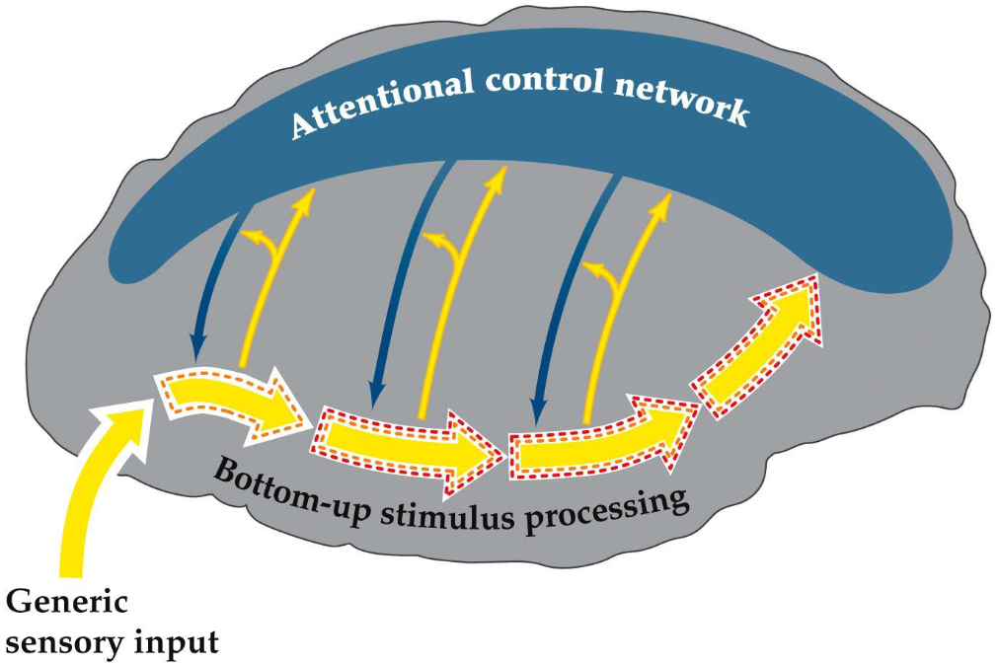 | --------------------------S--------------------------T--------------------------R--------------------------E--------------------------T--------------------------C--------------------------H-------------------------- |

**What we know about perspective 1:** Attentional regulation should be reflected by changes in neural activity. For sensory systems, this would be in the thick yellow arrows in the right-hand figure. However, studies measuringf behaviour performance (e.g. reaction time or accuracy) w.r.t. attention always depend on indirect approaches. Although, our ability to measure brain activity (while the subject is performing a task) has rapidly evolved in recent years. These developments can reveal much about neurobiological mechanisms of attentional effects on stimulus processing.

**What we know about perspective 2:** Studies have indicated that some higher-level brain areas are involved in attentional control. Particularly specific regions in the frontal and parietal lobes. This network seems to control attention with top-down neural signals (i.e. the descending blue arrows in the brain image) that regulate stimulus processing at multiple levels. These proposed mechanisms are explained in the following two subsections.

## Neural Effects of Auditory Attention on Stimulus Processing

The activity from 0 to 10ms comes from the brain stem. 10ms is not enough time for a stimulus to be processed in the neocortex. We want to know when attention effects the response to the stimulus (brain stem, early in the neocortex, late in the neocortex, etc.)

### Early and Late Auditory Selection

\<figure on slide 12\>

## Neural Effects of Visual Attention on Stimulus Processing

### Neuroimaging of Visual Spatial Attention

\<slide 17\>

### Effect of Visual Spatial Attention on ...

placeholder

# 2. Cognitive Control by the Anterior Cingulate Cortex

The Anterior Cingulate Cortex (ACC) is the most activated brain region, and is assumed to be responsible for cognitive control.

The idea of **Cognitive Control** distinguishes between:

- **Automatic processes:** unconscious, can hardly remember
- **Cognitive control processes:** conscious, requires more thinking, can remember later. Could be because (for example):
  - Information is conflicting
  - Excess of information (requires searching for desired info)

**Two Major Theories on the Workings of the ACC:**

- **Conflict Monitoring Theory**
  - Suggests the ACC _monitors_ for situations in which cognitive control is needed
  - Old theory ('80-'90)
  - (_Cohen, Carter, Botvinick_)
- **Reward-Based Theories**
  - Argue ACC has a more _active_ role in _selecting actions_
  - Based on a Bilological and Neurophysiological view
  - (_Holroyd, Coles, Rushworth_)
  - Based on humans and animals

**Developments in the field of Attentional Control:**

| Period     | Developments                         | Available Means                    |
| ---------- | ------------------------------------ | ---------------------------------- |
| 80's       | **box and arrow models**             | _didn't have any fancy techniques_ |
| early 90's | **computational models of the mind** | _developing AI techniques_         |
| late 90's  | **functional neuroimaging of ACC**   | _neuroimaging techniques_          |
| 00's/10's  | **challenges from other fields**     |                                    |

## Box and Arrow Models (80's)

_Let's go back in time, to when the ACC wasn't discovered yet._

|                                                              | Stroop Task --- _John Stroop (1935)_                         |
| ------------------------------------------------------------ | ------------------------------------------------------------ |
| **Method:** participants name the colour of a word. Some match and some don't.  **Result:** non-matching words take longer to process.  **Conclusion:** IF the word is father than the colour  AND the word interferes with the colour, but the colour not interfere with the word  THEN the word is automatic and the colour is controlled | RED  GREEN  BLUE |

The results of the **Stroop Task** make a distinction between _AUTOMATIC_ and _CONTROLLED_ processes.

_This line of reasoning resulted in the following model:_

|                                                              | Supervisory Attentional System (SAS) --- _Norman & Shallice (1986)_ |
| ------------------------------------------------------------ | ------------------------------------------------------------ |
| 1.) **Perceptual System** processes information.  2.) **Range of Possible Actions** we could take as a result  3.) **Automated Scheduling** determines correct action based on simple selection process  4.)  **Supervisory Attentional System** kicks in when more complicated processing is needed | 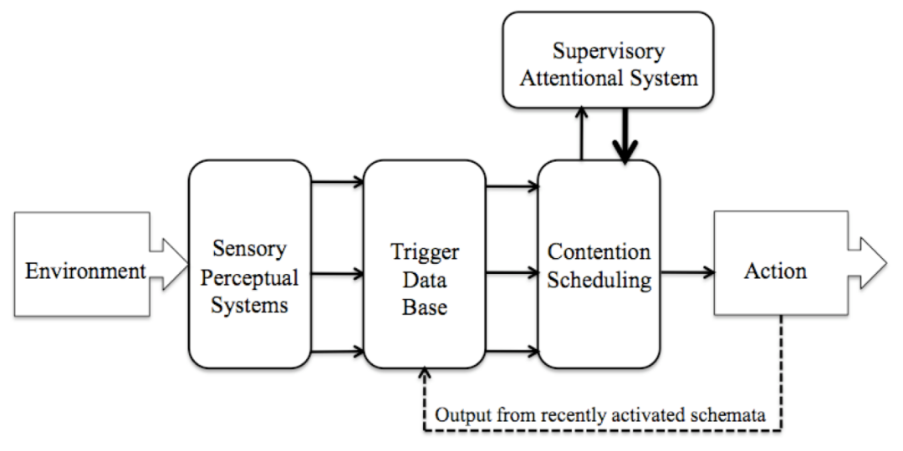                                        |

**Problems with this Model:**

- The SAS is basically just a black box (or homunculus) whose inner workings aren't explained at all
- Assumes processes are either fully controlled or fully automatic
- Doesn't explain when and how the SAS gets activated

## Computational Models of the Mind (early 90's)

### Possible Inner Workings of the SAS

_People tried to prove the validity (or satisfactory) of the SAS by formalizing it using a connectionist model:_

|                                                              | Early Connectionist Model for Stroop Task  --- _Cohen et. al. (1990)_ |
| ------------------------------------------------------------ | ------------------------------------------------------------ |
| **Research Question:** _"Can we feed this model information in such a way that it performs similar to humans in the Stroop task?"_  **How it works when trained:** the TASK DEMAND nodes pre-activate the hidden nodes to correspond to the desired task. Visual stimuli activate the INK COLOR and WORD nodes. The base value of the WORD nodes is higher to simulate faster processing for words. | 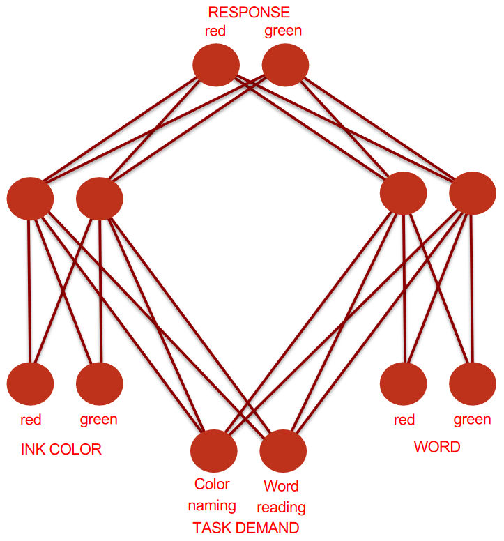                                        |

|                                                              | Results of the Above Model |
| ------------------------------------------------------------ | -------------------------- |
| The connectionist model does indeed produce data similar to that of the human Stroop task. Namely:  - words are always processed faster than colours  - colour doesn't impact word naming  - words to influence colour naming  - difference is due to interference, not facilitation  (i.e. one strengthening the other) | 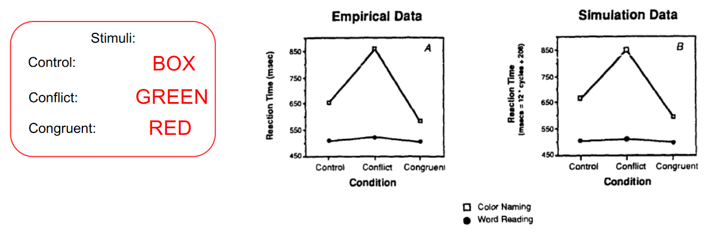      |

### Are Processes All-Or-Nothing?

_Now that we have a model that explains Stroop task data, we can use it to determine of automatic vs. controlled processes are all-or-nothing or more gradual:_

|                                                              | "Automatic vs Controlled" Experiment --- _Cohen et. al. (1990)_ |
| ------------------------------------------------------------ | ------------------------------------------------------------ |
| **Method:** participants has to associate a shape with a colour. Then performed the Stroop task with shapes instead of words. (e.g. task=name associated colour, presented=red triangle, desired answer=green, distractor=red)  **Result:** initially colour naming is much faster. After 5 days the reaction times are roughly equal. After 20 days the associated colour is more automatic  **Conclusion:** control is something you can "play with". Attentional processes aren't all-or-nothing, but can move on a spectrum between automatic and controlled | 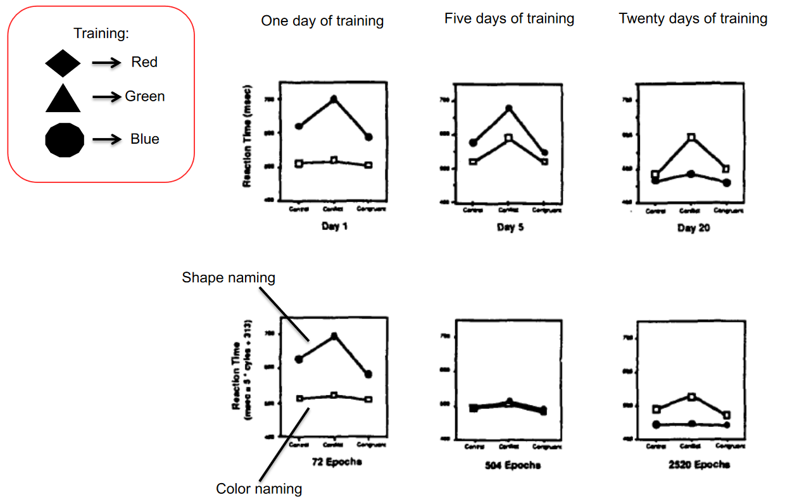  
x-axis: "control, conflict, congruent"
 |

### How the SAS could be activated

_Now we have a possible explanation for the inner workings of the SAS. But it still doesn't explain when control is needed._

|                                                              | Conflict Monitoring Model  --- _Botvinick et al. (2001)_ |
| ------------------------------------------------------------ | ------------------------------------------------------------ |
| Idea: take the already existing connectionist model for the Stroop task and add another node that functions as a conflict monitor. This conflict monitor is the **product of the two response nodes**. The conflict monitor activates the TASK DEMAND nodes | 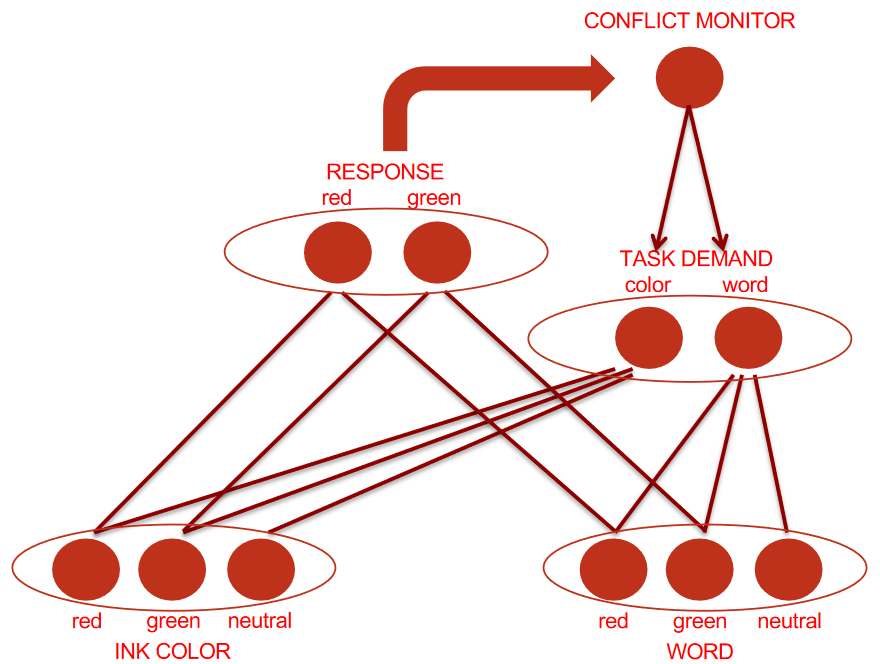                                        |

_Now we have a model that embodies the basic properties of the ACC, but is this model indeed correct? If it is, then it should also embody the fact that people remain more aware for a short time after needing cognitive control (e.g. a hightened sense of awareness after someone jumps in front of your car)._ 

| Effects of Incongruency Ratio on Interference --- _Tzelgov et al. (1992)_ | Human Trial Data      | Connectionist Data    |
| ------------------------------------------------------------ | --------------------- | --------------------- |
| To figure this out, people experimented with the ratio of congruent vs incongruent trials (x-axis displays ratio of incongruent to congruent trials)  **Method:** just the Stroop task with humans again, this time with varying ratios of incongruency.  **Result:** high incongruency ratios result in lower interference. **Similar results** for the Conflict Monitoring Model.   **Conclusion:** the Conflict Monitoring Model captures the presence prolonged activation of cognitive control in human cognition. | 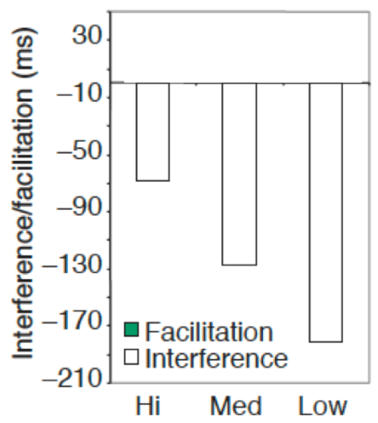 | 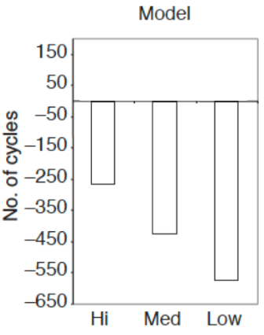 |

## Neuroimaging Studies (late 90's)

_In the 90's, people tried using neuroimaging to locate the modules of the Conflict Monitoring Model in the brain_

### Locating the Conflict Monitoring Module

In the 90's, people attempted to find the 'conflict module' in the brain, by making the following distinctions between subsequent stimuli:

**Method:**

- A **Congruent** stimulus followed by an **Incongruent** stimulus should result in a...
  - $\Rightarrow$ **High Activation** of the conflict module in the 2nd trial
- All other combinations of congruent and incongruent stimuli should result in a...
  - $\Rightarrow​$ **Low Activation** of the conflict module in the 2nd trial

The **important distinction** here was that the conflict module should _not_ be active for an incongruent stimulus when it follows from another incongruent stimulus, since at that point the cognitive control module should still be activated from the first stimulus.

|                                                              | Finding the Conflict Module --- _Carter et al. (2000)_ |
| ------------------------------------------------------------ | ------------------------------------------------------ |
| **Result:** when running this experiment, only one brain region stands out: the ACC | 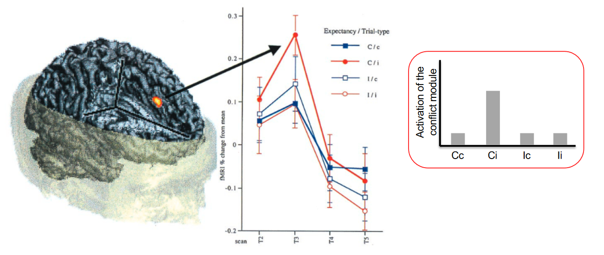                                  |

### Locating the Task Demand Module

| Locating the Task Demand Module --- _MacDonald et al. (2000)_ |                       |
| ------------------------------------------------------------ | --------------------- |
| **Method:** a Stroop Task where participants were asked to prepare for either WORDS or COLOURS.  In the case of WORDS, the Task Demand Module should be relatively silent, whereas for COLOURS, it should be active.  The ACC (which was just established to be the Conflict Monitoring Module) should be silent in both cases (this is because no stimuli are presented yet, only an indication of what to prepare for). When a stimulus is presented (congruent vs. incongruent), the Task Demand Module shouldn't care very much, but the Conflict Module (ACC) should be ctive.  **Result:** The ACC behaves as expected, and the brain region that fits the criteria for the Task Demand Module is the **Dorsal Lateral Prefrontal Cortex** | 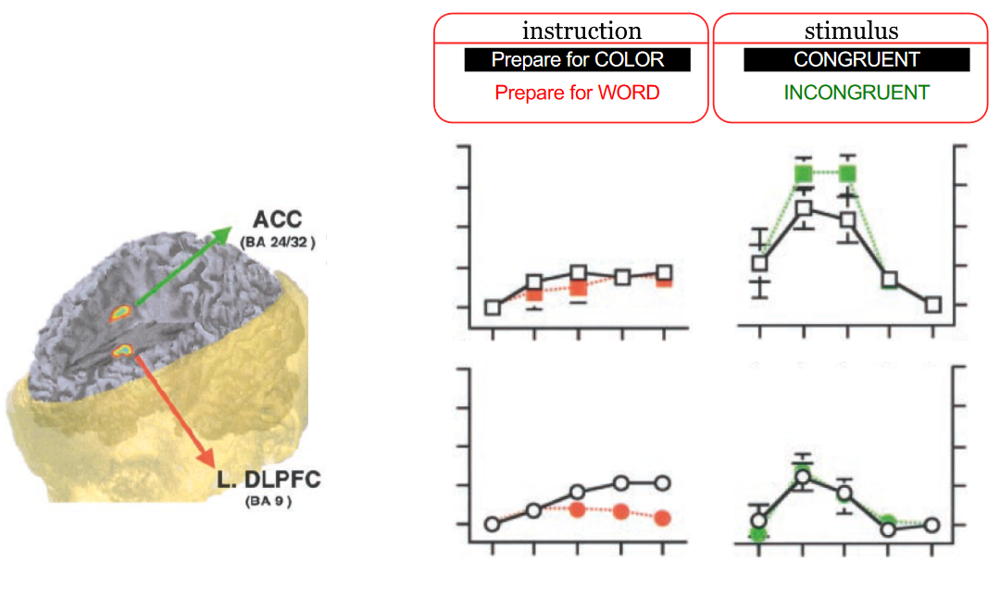 |

| Resulting Link between Modules and Brain Regions |                                                        |
| ------------------------------------------------ | ------------------------------------------------------ |
| 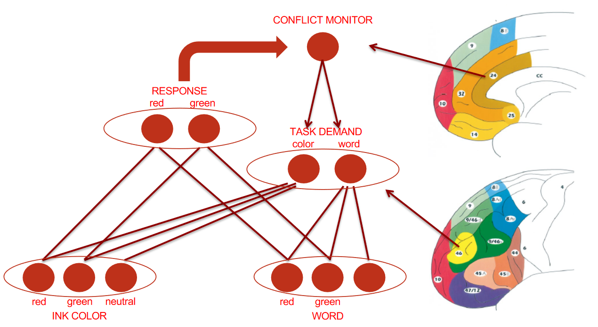                            | ooooooooooooooooooooo |

### Is the ACC Activated by Everything?

(...)

|                                                              | Willed Action and Prefrontal Cortex in Man --- _(1991)_ |
| ------------------------------------------------------------ | ------------------------------------------------------- |
| **Method:** scan brain activity via PET. Participants had to make _a_ movement after a stimulus.  **Result:** Activation in the ACC | 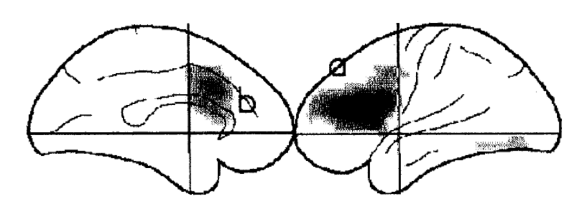                                    |

| Anatomy of the ACC  --- _Rushworth et al. (2004)_       | Subdivision of Activation in the ACC --- _Ridderinkhof et al. (2004)_ |
| ------------------------------------------------------------ | ------------------------------------------------------------ |
| 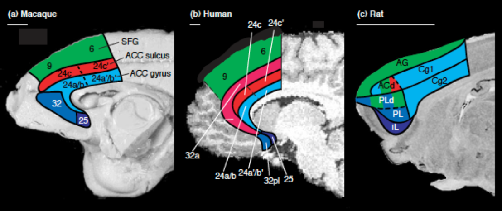                                         | 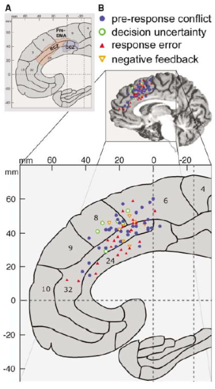                                         |
| Sight of the medial wall (split between the hemispheres). Shows similar structures in mammals (indicates the ACC to be an acient structure) | No apparent distinction between parts of the ACC when performing certain types of tasks. |

# 3. Frontal Asymmetry of Motivational Control

# 4. Visual Stability

# 5. Motor Control

# 6. Neocortical Consolidation

# 7. Semantic Integration in Sentence Processing

