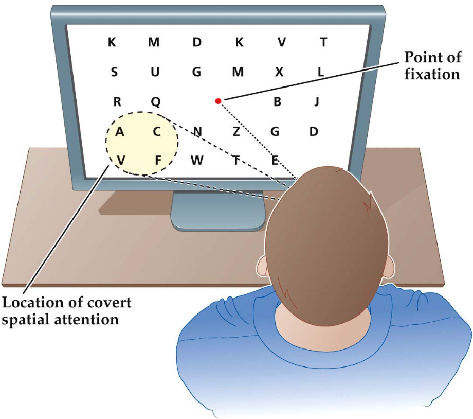
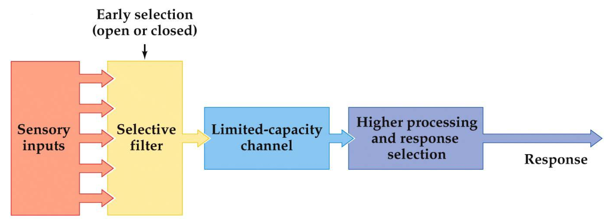
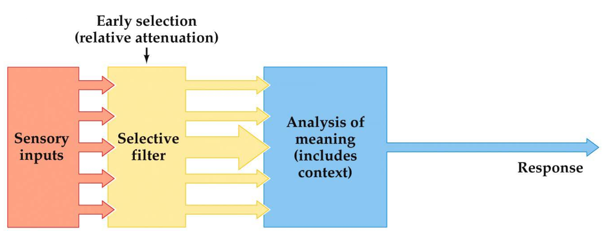
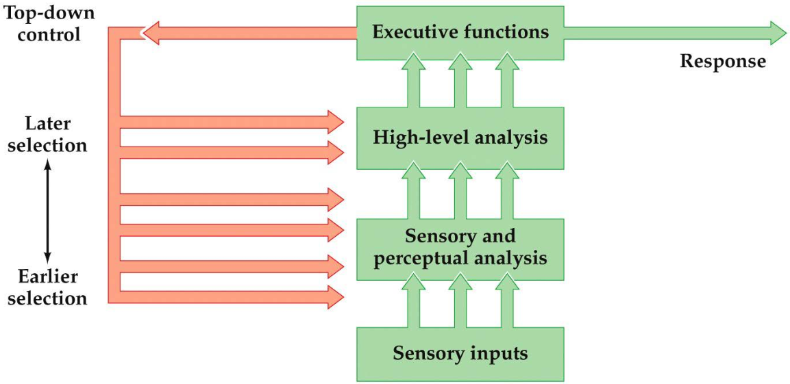
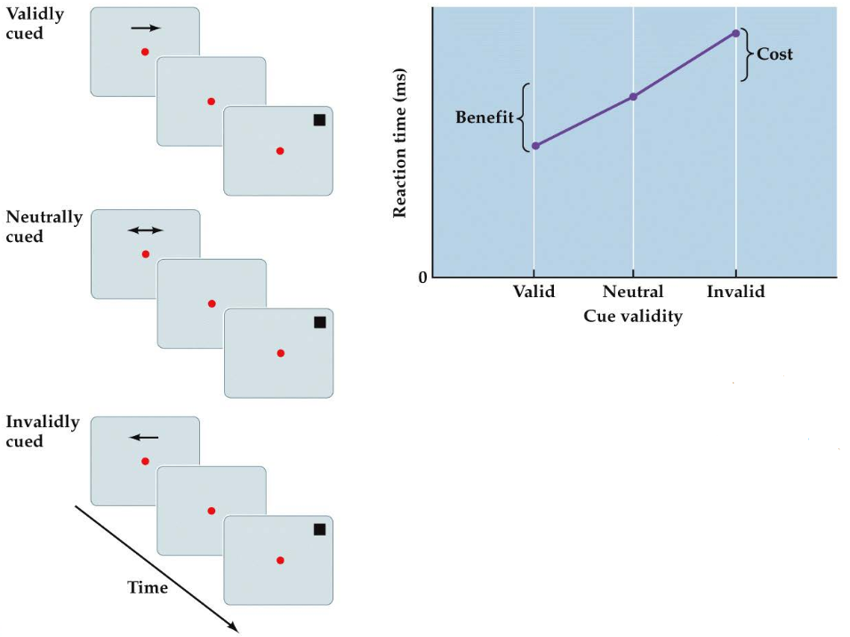
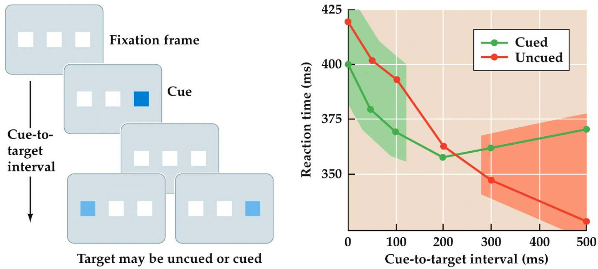
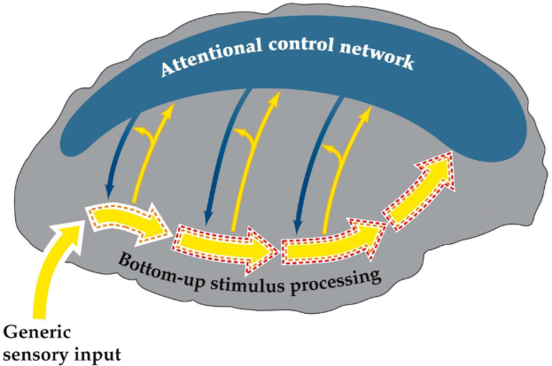

# 1. Attention by Biased Competition

## Cocktail Party Effect

The phenomenon in which multiple conversations and other sounds are occurring simultaneously, yet a listener can selectively focus on one voice or conversation and effectively tune out the others.

| Cocktail Party Experiment --- _Colin Cherry (1953)_          |      |
| :----------------------------------------------------------- | ---- |
| **Method:** 2 different messages are presented to the left and right ear respectively. The subject has to attend the message in a specific ear and repeat it immediately (i.e. shadowing). The content of the unattended message is also asked.  **Result:** Subjects could accurately report the content of the attended message, but struggled with the unattended message (i.e. performance is better after a valid cue). Though most subjects accurately reported the gender of the speaker of the unattended message. Subjects also struggled with attending 2 streams simultaneously.  **Conclusion:** 1.) Even if multiple pass through the ears, cochlea and nervous system, we can focus on one and block out the others by means of our conscious attention.  2.) The cue that instructs us what stream we have to attend to is kept "alive" in neuronal circuits long before the actual stimulus appears.  3.) The attended stream enters conscious awareness and can later be remembered. |      |

Later experiments showed that attention was given to the unattended message when it mentioned the subject's name. This indicates that some info in the unattended message makes it to the semantic level.  Fun fact: impairment of selective attention is one of the major symptoms in pathological states such as schizophrenia and ADHD.

## Attention

Attention is a broad term, so a clear distinction between it and other terms must be made. Most notably arousal.

**Attention & Arousal**:

-   Arousal describes the global state of the brain. The broadest categorization is the spectrum between being awake or asleep.
-   When asleep, people are very unattentive. But when awake, people can have varying levels of attentiveness.
-   Research shows that people have slower reactions and reduced performance in cognitive tasks when drowsy.
-   Most often, **attention is selectively focused**. Meaning that processing resources are allocated to certain stimuli, while neglecting other stimuli.
-   Lecturer: *"Selective attention assumes a minimum level of arousal, on top of which there is selection that is driven by a certain dimension (e.g. spatial, auditory, etc.)"*

|                                                 | Studying Visual Spatial Attention --- _Hermann von Helmholtz_ |
| ----------------------------------------------- | ------------------------------------------------------------ |
|  | **Method:** Example of the cocktail party effect. Subjects were briefly presented with an array of letters and asked to recall them afterwards. Subjects also had to attend a certain portion of the array without shifting their gaze.  **Result:** The items in the attended portion could be accurately reported, but not the other ones.  **Interpretation:** People are able to attend a certain portion of the visual field without shifting their gaze towards it (i.e. covert/peripheral attention). As opposed to when the gaze is directed towards a stimulus (i.e. overt attention). |

## Attention Selection Models

**Early selection** states that irrelevant information is filtered out before it is analyzed.

**Late selection** states that information is first processed before selection occurs.

|                                                 | Early Selection Model --- _Broadbent_                        |
| ----------------------------------------------- | ------------------------------------------------------------ |
|  | All-or-nothing model. Incoherent with the fact that highly relevant information (such as your name) in an unattended stream still enters consciousness. |

 

|                                                 | Early Selection Based Attenuation Model --- _Treisman_       |
| ----------------------------------------------- | ------------------------------------------------------------ |
|  | Some unattended semantic information makes it to the analysis stage. Though only information that stands out (like your own name) passes through the first filter. |

 

|                                                 | Early, Middle and Late Top-Down Selection                    |
| ----------------------------------------------- | ------------------------------------------------------------ |
|  | Allows for early selection based on physical characteristics, but also late selection when semantic processing is needed for selection. It uses top-down control for this approach. |

## Endogenous vs. Exogenous Attention

**Endogenous attention** applies to situations where a subject voluntarily directs their attention towards stimulus, usually by interpreting a cue (such as an arrow). If the cue provides no information (i.e. a neutral cue), there is no change in behaviour.

| f                         | f                                                            |
| ------------------------- | ------------------------------------------------------------ |
|  | **Method:** The subject's gaze is fixed on a central point. They're presented with a valid, invalid or neutral, position related cue.  The subject has to indicate that the target appeared when it does, regardless of the cue.   **Result:** Subjects are faster to respond to validly cued targets than invalidly queued ones, with the response time of neutrally cued targets  being in the middle. The effect of the queue lasts from 300 milliseconds to several seconds. |

**Exogenous attention** applies to situations where attention is reflexively directed towards a stimulus. Such as when a loud sound is heard.

| f                         | f                                                            |
| ------------------------- | ------------------------------------------------------------ |
|  | **Method:** Subjects are presented with a sensory cue (e.g. a flash of light) at a particular location shortly before the target stimulus is presented in either that location or elsewhere.   **Result:** Reaction time increases when presented with a valid cue shortly before the target stimulus (green area). When increasing the interval, however, the response time for validly cued targets  decreases. This is due to something known as inhibition of return (after Klein, 2000). |

## Neuroscience Approach to Studying Attention

Cognitive psychologists generally think attention works as in the 3rd model in section ... . When translating this model to a neuroscience framework, attention tends to be approached from two main perspectives:

1.  Investigating how the neural processing of stimuli are regulated by attention.
2.  Determining the brain regions that coordinate these regulations (i.e. the higher-level control regulations), and the mechanisms these regions use.

|                             |                                                              |
| --------------------------- | ------------------------------------------------------------ |
|  | ooooooooooooooooooooooooooooooooooooooooooooooooooooooooooooooooooooooo |

**What we know about perspective 1:** Attentional regulation should be reflected by changes in neural activity. For sensory systems, this would be in the thick yellow arrows in the right-hand figure. However, studies measuring behaviour performance (e.g. reaction time or accuracy) w.r.t. attention always depend on indirect approaches. Although, our ability to measure brain activity (while the subject is performing a task) has rapidly evolved in recent years. These developments can reveal much about neurobiological mechanisms of attentional effects on stimulus processing.

**What we know about perspective 2:** Studies have indicated that some higher-level brain areas are involved in attentional control. Particularly specific regions in the frontal and parietal lobes. This network seems to control attention with top-down neural signals (i.e. the descending blue arrows in the brain image) that regulate stimulus processing at multiple levels. These proposed mechanisms are explained in the following two subsections.

## Neural Effects of Auditory Attention on Stimulus Processing

The activity from 0 to 10ms comes from the brain stem. 10ms is not enough time for a stimulus to be processed in the neocortex. We want to know when attention effects the response to the stimulus (brain stem, early in the neocortex, late in the neocortex, etc.)

### Early and Late Auditory Selection

\<figure on slide 12\>

## Neural Effects of Visual Attention on Stimulus Processing

### Neuroimaging of Visual Spatial Attention

\<slide 17\>

### Effect of Visual Spatial Attention on ...

# 2. Cognitive Control by the Anterior Cingulate Cortex

# 3. Frontal Asymmetry of Motivational Control

# 4. Visual Stability

# 5. Motor Control

# 6. Neocortical Consolidation

# 7. Semantic Integration in Sentence Processing

